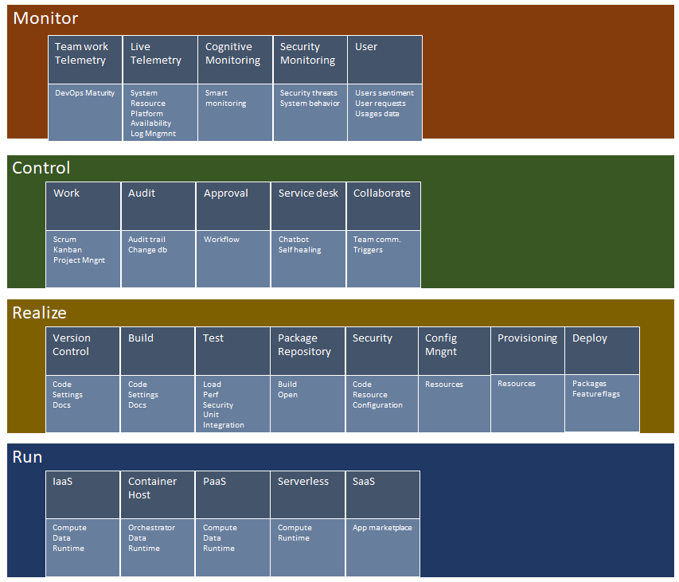

# DevOps team tool capability support needs.

A repository with DevOps practices and tool capability needs.

## The Idea

DevOps is next to culture also automation. This automation aspect is supported by different practices and technologies which relies heavy on tools. These tools offer capabilities which makes the life of a team member easier and supports the system to fulfill the business needs.

Tools evolve overtime very quickly now most vendors have adopted a DevOps way of working them self. Capabilities are constantly added, changed or removed. More stable are the needs of DevOps teams and systems. They need to be able to create, run, monitor and control systems in vary of ways. 

This repository contains a set of needs for DevOps teams and systems, tool capabilities can be mapped against it per team. In this way teams can find the tool support in a more structured way and trade-offs are know.

The topics are organization in four main categories, each with multiple topics (see [image](Images/DevOpsToolCapabilitiesOverview.png)): 

- [Monitor](Docs/Monitor.md)
	- [Team Telemetry](Docs/Monitor.md#Team-Telemetry)
	- [Live Site Telemetry](Docs/Monitor.md#Live-Site-Telemetry)
	- [Cognitive Monitoring](Docs/Monitor.md#Cognitive-Monitoring)
	- [Security Monitoring](Docs/Monitor.md#Security-Monitoring)
	- [User Telemetry](Docs/Monitor.md#User-Telemetry)
- [Control](Docs/Control.md)
	- [Work](Docs/Control.md#Work)
	- [Audit](Docs/Control.md#Audit)
	- [Approval](Docs/Control.md#Approval)
	- [ServiceDesk](Docs/Control.md#Service-Desk)
	- [Collaborate](Docs/Control.md#Collaborate)
- [Create](Docs/Create.md)
	- [VersionControl](Docs/Create.md#Version-Control.md)
	- [Build](Docs/Create.md#Build)
	- [Test](Docs/Create.md#Test)
	- [Package Repository](Docs/Create.md#Package-Repository)
	- [Security](Docs/Create.md#Security)
	- [Configuration Management](Docs/Create.md#Configuratio-nManagement)
	- [Provisioning](Docs/Create.md#Provisioning)
	- [Deploy](Docs/Create.md#Deploy)
- [Run](Docs/Run.md)
	- [IaaS](Docs/Run.md#IaaS)
	- [Container Host](Docs/Run.md#Container-Host)
	- [PaaS](Docs/Run.md#PaaS)
	- [Serverless](Docs/Run.md#Serverless)
	- [SaaS](Docs/Run.md#SaaS)

## Getting started

Just read the repo or clone when you want to use it for your own teams.

## Contribute

Pull requests serve as the primary mechanism by which contributions are proposed and accepted. We recommend creating a [topic branch](https://www.git-scm.com/book/en/v2/Git-Branching-Branching-Workflows#Topic-Branches) and sending a pull request to the master branch from the topic branch. For additional guidance, read through the [GitHub Flow Guide](https://guides.github.com/introduction/flow/).

Be prepared to address feedback on your pull request and iterate if necessary.

## Updates

* 14 January 2018 Start